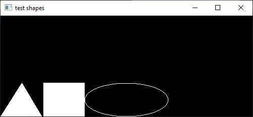

# Shapes
This is a 101 project for drawing shapes making use of C++ OOP approach and
OpenGL

# Build and compile
This project is CMake-based, for build and compile please run:
```shell
cmake -B build && cmake --build build --target all -j4
```

# Invocation
To invoke an executable:
```shell
./build/test_shapes
```

One should receive something like this:

